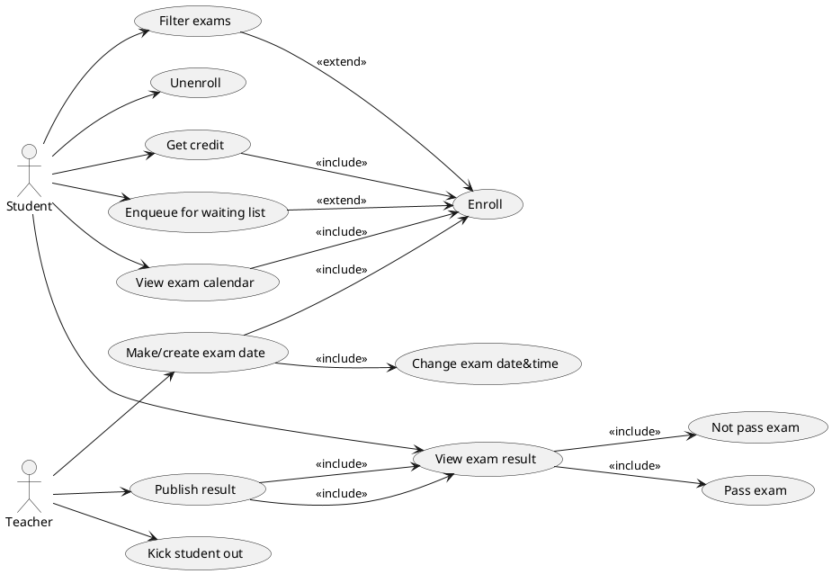

# Student information system - Exams

The Student Information System (SIS) Exams Module is an integral component of the university's academic infrastructure, designed to streamline the management of examination-related processes for both students and faculty. This module provides a comprehensive platform to efficiently administer, schedule, monitor, and evaluate exams, ensuring smooth operations during the assessment period.

## Functional Requirements

This section specifies the functional requirements.

### User requirements

**Students**
- If an exam is full, I should be able to put myself in a waiting queue that will automatically sign me up for the exam if a spot opens up, because I do not want to check it too often.
- I should be able to view my exam schedule/calendar, because with a lot of enrolled exams, a list view may be disorienting.
- I should be able to filter available exams based on the course they belong to, and whether I have already passed them, because it will be less distracting for me.
- As a student, I should be able to enroll in exams and assessments because I need to fulfill my academic requirements.
- As a student, I should be able to view my examination results as soon as they are published because I want to keep track of my academic progress.
- As a student, I should be able to view my examination history, including past scores and feedback, because I want to evaluate my academic performance over time.
- As a student, I should be able to download or print my exam results for my records because I may need them for personal documentation or verification purposes.
**Teachers**
- I should be able to kick out enrolled students automatically if they have not yet fulfilled criteria needed for the enrollment (e.g. credit), because it will be tedious to do so manually.
- As examiner, I should be able to publish exam results efficiently because it is essential to provide timely feedback to students.
- As examiner, I should be able to manage the enrollment lists for the courses I am teaching because I need to prepare for the assessment process accordingly.
- As examiner, I should be able to provide detailed feedback on student performance because it helps students learn from their mistakes and achievements.

### System requirements

#### Actors

##### Student

The student actor represents an individual enrolled in courses and participating in exams within the educational system.

##### Teacher

The teacher actor represents an instructor or educator who conducts classes, administers exams, and provides feedback within the educational system.

##### Results and exams


#### Overview
This UML diagram provides a comprehensive view of the inner workings of SIS, particularly in the realm of exams and results, offering insights from both student and teacher perspectives. It outlines the various actors involved and their roles within the system. Think of it as a roadmap that sheds light on how the SIS operates behind the scenes, detailing what actions each actor can take and their prerequisites before and after interacting with the SIS.

## Use cases

### Queue:

**Happy Path:**
1. The student loggs into their account. 
2. The system displays the home page.
3. The student clicks on the icon to sign up for exams.
4. The system presents a list of upcoming exams with filtering options.
5. The student selects an exam with full capacity to enroll in. 
6. The system places the student in the waiting queue.

**Potential Issues:**
- In step 1, the student encounters difficulty logging into the system.
- In step 4, no exams are available for enrollment. 
- In step 6, the deadline for enrolling in the exam has passed.
- In step 6, the exam's capacity is not full, so the system automatically enrolls the student.
- In step 6, the student cannot enroll in the waiting queue due to unfulfilled exam requirements.

**Preconditions:**
- The selected exam has reached full capacity.
- Enrollment for the exam is still open.
**Postconditions:**
- The student can view their position in the queue.

### Enroll for Exam:

**Happy Path:**
1. The student logs into their account.
2. The system displays the home page.
3. The student clicks on the icon to sign up for exams.
4. The system presents a list of upcoming exams with filtering options.
5. The student selects an exam with a specific date to enroll in.
6. The system confirms the student's enrollment in the exam and assigns them a time slot.

**Potential Issues:**
- In step 1, the student encounters difficulty logging into the system.
- In step 4, no exams are available for enrollment.
- In step 5, there are no suitable exam dates for the student.
- In step 6, the deadline for enrolling in the exam has passed.
- In step 6, the exam's capacity is full, so the system automatically places the student on the waiting list.
- In step 6, the student cannot enroll in the exam due to unfulfilled exam requirements.

**Preconditions:**
- The student has the necessary credit for the subject.
- Enrollment for the exam is still open and has available slots.

**Postconditions:**
- The student is successfully enrolled in the exam for the selected term.

### Unenroll from exam:

**Happy Path:**   
1. The student logs into their account.
2. The system displays the home page.
3. The student clicks on the icon where are the exams that the student enrolled for.
4. The system presents a list of exams the student is enrolled for.
5. The student selects an exam with a specific name of the exam and icon to unenroll from the exam.
6. The system confirms the student's unenrollment from the exam.


**Potential Issues:**
- In step 1, the student encounters difficulty logging into the system.
- In step 4, there is no list of the exams he is enrolled for.
- In step 5, the deadline for unenrolling from the exam has passed.

**Preconditions:**
- To be enrolled for the exam.
- Unenrollment for the exam is still available.

**Postconditions:**
- Have the opportunity to enroll for another date or time.
- The student is successfully unenrolled from the exam.

### View exam result:

**Happy Path:**   
1. The student logs into their account.
2. The system displays the home page.
3. The student clicks on the icon where are the exams results that the student took.
4. The system presents the result of exams the student took.
5. The student has a look on the results from his exams.


**Potential Issues:**
- In step 1, the student encounters difficulty logging into the system.
- In step 4, there are no results from the exam yet.

**Preconditions:**
- The student had to take an exam he wants to see the results from.

**Postconditions:**
- To be able to view the correct results. 
    
## Information model

```plantuml
@startuml
class Exam {
  String name
  String courseCode
  DateTime examDate
}

class Credit {

}

class Result {
  String grade
  String feedback
}

class Student {
  String studentId
  String name
  List<Credit> creditsEarned
  Map<Exam, Result> examResults
}

class Teacher {
  String teacherId
  String name
  List<Exam> examsTeaching
}

Exam "1" -- "" Credit : to enroll for <
Credit "1" -- "" Student : is required to have <
Exam "1" -- "*" Result : produces >
Result "1" -- "1" Student : is received by >
Exam "1" -- "1" Teacher : gives <
Result "1" -- "1" Teacher : approves <
@enduml
```

### Student 
A user of SIS with defined privileges and attributes such as studentId and name, currently enrolled at the university.

### Teacher
A user of SIS with defined privileges and attributes such as teacherId and name, responsible for teaching subjects at the university.

### Result
A score from an exam, typically ranging from 1 to 4 or A to F, along with feedback provided by the teacher to evaluate the student's performance.

### Credit
A prerequisite for participating in exams.

### Exam 
An assessment, either written or oral, administered by a teacher to evaluate students' knowledge and skills.

### Subject
A course offered during a given semester, which students attend and teachers instruct.
