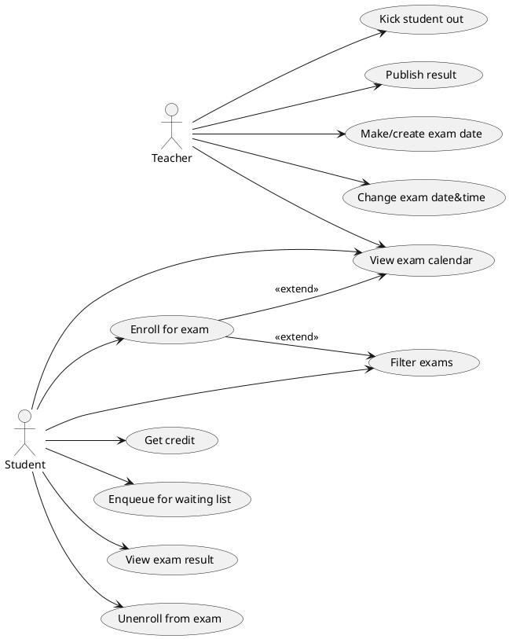
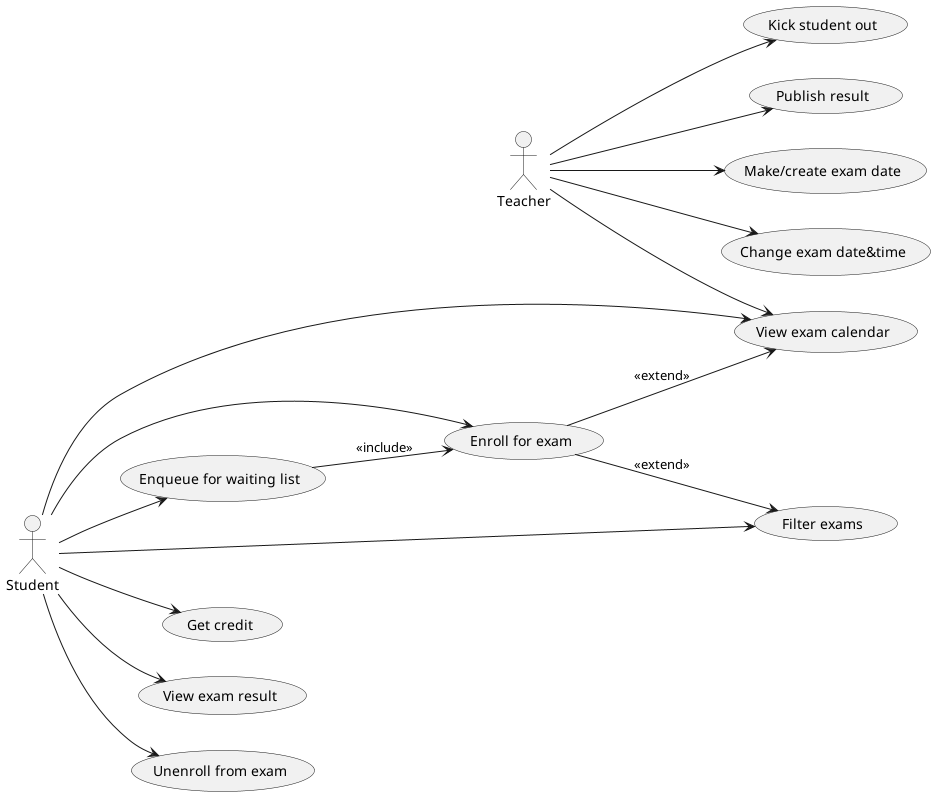
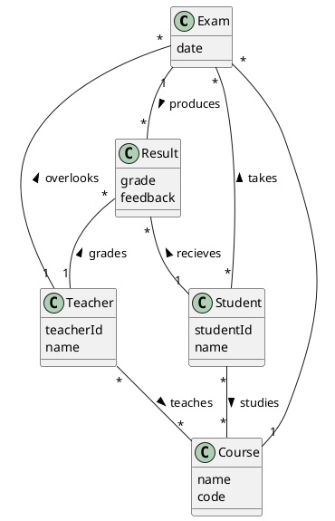
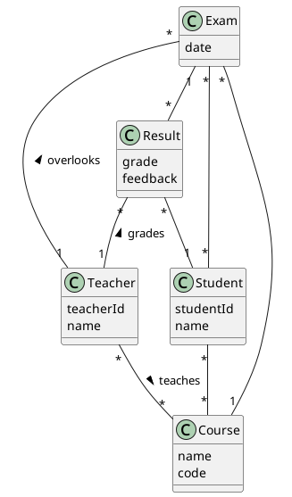

# Student information system - Exams

The Student Information System (SIS) Exams Module is an integral component of the university's academic infrastructure, designed to streamline the management of examination-related processes for both students and faculty. This module provides a comprehensive platform to efficiently administer, schedule, monitor, and evaluate exams, ensuring smooth operations during the assessment period.

## Functional Requirements

This section specifies the functional requirements.

### User requirements

**Students**
- If an exam is full, I should be able to put myself in a waiting queue that will automatically sign me up for the exam if a spot opens up, because I do not want to check it too often.
- I should be able to view my exam schedule/calendar, because with a lot of enrolled exams, a list view may be disorienting.
- I should be able to filter available exams based on the course they belong to, and whether I have already passed them, because it will be less distracting for me.
- As a student, I should be able to enroll in exams and assessments because I need to fulfill my academic requirements.
- As a student, I should be able to view my examination results as soon as they are published because I want to keep track of my academic progress.
- As a student, I should be able to view my examination history, including past scores and feedback, because I want to evaluate my academic performance over time.
- As a student, I should be able to download or print my exam results for my records because I may need them for personal documentation or verification purposes.
  
**Teachers**
- I should be able to kick out enrolled students automatically if they have not yet fulfilled criteria needed for the enrollment (e.g. credit), because it will be tedious to do so manually.
- As examiner, I should be able to publish exam results efficiently because it is essential to provide timely feedback to students.
- As examiner, I should be able to manage the enrollment lists for the courses I am teaching because I need to prepare for the assessment process accordingly.
- As examiner, I should be able to provide detailed feedback on student performance because it helps students learn from their mistakes and achievements.

### System requirements

#### Actors
- Student
- Teacher
  
##### Student

A student is a person studying at the university.
A student can view their personal results and credits gained in individual courses.
A student can enroll for exam of a lecture a student is admitted to and take the exam.

##### Teacher

 A teacher is an employee of the university.
 A teacher can set a date and time for the exam.
 A teacher is responsible for grading the students.
 A teacher may edit the students' exam and thesis results.

##### Results and exams

#### Overview
This UML diagram provides a comprehensive view of the inner workings of our system, particularly in the realm of exams and results, offering insights from both student and teacher perspectives. It outlines the various actors involved and their roles within the system. Think of it as a roadmap that sheds light on how the exams system operates behind the scenes, detailing what actions each actor can take and their prerequisites before and after interacting with the system.

## Use cases

### Queue:

**Happy Path:**
1. The student loggs into their account. 
2. The system displays the home page.
3. The student clicks on the icon to sign up for exams.
4. The system presents a list of upcoming exams with filtering options.
5. The student selects an exam with full capacity to enroll in. 
6. The system places the student in the waiting queue.

**Potential Issues:**
- In step 1, the student encounters difficulty logging into the system.
- In step 4, no exams are available for enrollment. 
- In step 6, the deadline for enrolling in the exam has passed.
- In step 6, the exam's capacity is not full, so the system automatically enrolls the student.
- In step 6, the student cannot enroll in the waiting queue due to unfulfilled exam requirements.

**Preconditions:**
- The selected exam has reached full capacity.
- Enrollment for the exam is still open.

**Postconditions:**
- The student can view their position in the queue.

### Enroll for Exam:

**Happy Path:**
1. The student logs into their account.
2. The system displays the home page.
3. The student clicks on the icon to sign up for exams.
4. The system presents a list of upcoming exams with filtering options.
5. The student selects an exam with a specific date to enroll in.
6. The system confirms the student's enrollment in the exam and assigns them a time slot.

**Potential Issues:**
- In step 1, the student encounters difficulty logging into the system.
- In step 4, no exams are available for enrollment.
- In step 5, there are no suitable exam dates for the student.
- In step 6, the deadline for enrolling in the exam has passed.
- In step 6, the exam's capacity is full, so the system automatically places the student on the waiting list.
- In step 6, the student cannot enroll in the exam due to unfulfilled exam requirements.

**Preconditions:**
- The student has the necessary credit for the subject.
- Enrollment for the exam is still open and has available slots.

**Postconditions:**
- The student is successfully enrolled in the exam for the selected term.

### Unenroll from exam:

**Happy Path:**   
1. The student logs into their account.
2. The system displays the home page.
3. The student clicks on the icon where are the exams that the student enrolled for.
4. The system presents a list of exams the student is enrolled for.
5. The student selects an exam with a specific name of the exam and icon to unenroll from the exam.
6. The system confirms the student's unenrollment from the exam.

**Potential Issues:**
- In step 1, the student encounters difficulty logging into the system.
- In step 4, there is no list of the exams he is enrolled for.
- In step 5, the deadline for unenrolling from the exam has passed.

**Preconditions:**
- To be enrolled for the exam.
- Unenrollment for the exam is still available.

**Postconditions:**
- Have the opportunity to enroll for another date or time.
- The student is successfully unenrolled from the exam.

### View Exam Result

**Happy path:**
1. The user logs into their account.
2. The system displays the home page.
3. The student clicks on a button.
4. The system redirects him to the results
5. The student selects the course for which they want to see the result
6. The result is there and the user sees it. 

**Potential Issues:**
- The user does not have an account (1.)
- The student has not attended any exams yet (4.)
- The student has not attended an exam for the course they selected (5.)
- The student has attended the exam, but the results are not ready yet (6.)

**Preconditions:**
- Enroll for the exam
- Attend the exam

**Postconditions:**
- None

### Make/create exam

**Happy path:**
1. The user logs into their teacher account.
2. The system displays the homepage.
3. The teacher clicks a button that is supposed to redirect him to a view of the courses they teach.
4. The system redirects him to that view.
5. The teacher clicks a 'create exam' button next to the course they want to create the exam for.
6. The system shows a view that allows the user to select place, time and date of the exam.
7. The teacher fills out all of those.
8. The exam is created.

**Potential issues:**
- The user does not have a teachers account (1.)
- The teacher does not teach any courses in that semester (3.)
- The place, time and date combination is already taken (7.)

**Preconditions:**
- Have teacher rights
- Teach this course
- Selected date,time&place is not booked

**Postconditions:**
- Have the ability to change the time,date&place

### Publish Result

**Happy Path:**

1. The teacher logs into their account on the Student Information System.
2. The system displays the teacher's dashboard.
3. The teacher selects the course for which they want to publish exam results.
4. The system displays a list of completed exams along with options to enter or upload results.
5. The teacher inputs or uploads the finalized exam results.
6. The system verifies the accuracy and completeness of the uploaded data.
7. The teacher confirms the publication of the results.
8. The system publishes the results, making them visible to the students.
9. Students receive notifications that their exam results are available for viewing.

**Potential Issues:**

- In step 1, the teacher encounters difficulty logging into the system.
- In step 4, the system fails to display the correct exams, showing exams that are not yet ready for result publication.
- In step 5, the teacher inputs incomplete or incorrect results, requiring revision.
- In step 6, the system encounters an error during data verification, delaying the process.
- In step 7, the teacher inadvertently publishes the wrong results, necessitating a retraction and correction.
- In step 8, the results do not appear for students due to a delay or error in the publication process.
- In step 9, students do not receive notifications due to an issue with the notification system.

**Preconditions:**

- The exams have been completed and graded.
- The teacher has the necessary permissions to publish results for the course.

**Postconditions:**

- Exam results are accurately published and visible to students.
- Notifications are sent out to all relevant students about the availability of their results.
- The system logs the publication event for auditing and compliance purposes.

### Filter Exams

**Happy Path:**

1. The student logs into their account on the Student Information System.
2. The system displays the student's dashboard.
3. The student navigates to the "Exams" section to view upcoming exams.
4. The system presents a set of filtering options, such as term, subject, and date.
5. The student selects the desired criteria from the available options to filter the exams.
6. The system processes the request and displays a list of exam terms that meet the selected criteria.
7. The student reviews the filtered list of exam terms.

**Potential Issues:**

1. In step 5, there are no exam terms that meet the selected filtering criteria, resulting in no exams being displayed.
2. In step 5, the student attempts to filter exams for a subject they are not enrolled in, leading to an error message.

**Preconditions:**

- A list of terms for exams is available in the system.
- The student is enrolled in the subject for which they are attempting to filter exams.

**Postconditions:**

- The system displays a list of all the exam terms that meet the criteria selected by the student.

### Kick Student Out

**Happy Path**:

1. The teacher logs into their account on the Student Information System.
2. The system displays the teacher's dashboard.
3. The teacher accesses the enrollment list for a specific course.
4. The system presents a list of all enrolled students along with their eligibility status.
5. The teacher selects a student who has not met the necessary prerequisites for the exam.
6. The system processes the removal of the student from the enrollment list.
7. The student receives a notification of their removal due to unmet prerequisites.

**Potential Issues**:

- In step 1, the teacher encounters difficulty logging into the system.
- In step 3, the system fails to load the enrollment list due to a technical error.
- In step 5, the system shows incorrect data, leading to the wrongful selection of a student who actually meets the prerequisites.
- In step 6, the system fails to remove the student from the list due to a processing error.
- In step 7, the student does not receive the notification due to an issue with the notification system.

**Preconditions:**

- The student is currently enrolled in an exam for which they have not fulfilled the necessary criteria.
- The teacher is authorized to manage course enrollments.

**Postconditions:**

- The student is removed from the exam enrollment list.
- Both the student and the teacher receive confirmation of the enrollment change.
- The system updates its records to reflect the removal for auditing and tracking purposes.

### Get credit:

**Detail:**

1. The user logs into their teacher account.
2. The system displays the homepage.
3. The teacher clicks a button that is supposed to redirect him to a view of the courses they teach.
4. The system redirects him to that view.
5. The teacher finds the student he wants to give credit to.
6. The system shows him the student account.
7. Teacher awards credit to the student

**Alternatives:** 

1. Not having enough points the acquire the credit for the subject
2. Not having submitted credit work before deadline

**Prerequirements:**

- To meet the criteria for acquiring the credit for the subject
- To be enrolled for the subject

**Postrequirements:**

- Permission to be able to enroll for the exam

### Pass exam:

**Detail:**

1. Student takes the exam
2. Teacher passes the student

**Alternatives:** 

1. In step 2, the teacher may not award enough points to make the student pass.

**Prerequirement:**

- To be enrolled for the specific exam date that you are taking

**Postrequirement:**

- Completing the subject and passing the exam you enrolled.

## Information model

### Student 
A user of our student integration system with defined privileges and attributes such as studentId and name, currently enrolled at the university.

### Teacher
A user of our student integration system with defined privileges and attributes such as teacherId and name, responsible for teaching subjects at the university.

### Result
A score from an exam, typically ranging from 1 to 4 or A to F, along with feedback provided by the teacher to evaluate the student's performance.

### Exam 
An assessment, either written or oral, administered by a teacher to evaluate students' knowledge and skills.

### Subject
A course offered during a given semester, which students attend and teachers instruct.
